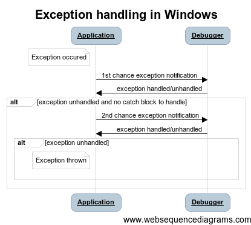

Diagnosing .NET exceptions in VS
================================

When a debugger is attached to a Windows application it will receive notifications about all exceptions that occur in it. There are two types of notifications:

- 1st chance exception - sent at an exact moment when the exception is thrown (before any catch statement)
- 2nd chance exception - sent if 1st chance exception was unhandled and there was no catch statement to handle the exception

In the diagram below I tried to show the flow:



1st chance exceptions
---------------------

By default, first chance exceptions are hidden by the Visual Studio debugger - the only place where you can find information about them is either the Output Window or the Immediate Window (if redirection is set in Debugger options). Example exception notification:

```
A first chance exception of type 'System.AggregateException' occurred in mscorlib.dll
```

Knowing the 1st chance exception type, you may force Visual Studio to stop at it. For this purpose use **Exceptions** dialog from **Debug** menu. If the exception is of the system type (defined in the framework) use the Find button, otherwise add it to the list. After marking the **Thrown** checkbox and restarting the debugger, VS should stop at the throw statement. Now you have a chance to correct the code and handle the exception - just press OK, then use Ctrl+Shift+F10 on the current source line (to set execution point) and make necessary changes (either in variable values or in code if Edit & Continue is enabled). Then you may continue the application execution and the exception should be handled. This technic might not always work - especially when the exception is thrown in an external code or the current method was highly optimized.

2nd chance exceptions
---------------------

Second chance exceptions are by default displayed by Visual Studio in the Exception Thrown dialog. Unfortunately, there is not much to be done at this point except logging an exception or taking a dump for further analysis (Debug - Save Dump As...).

