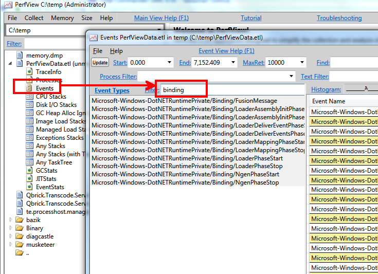

.NET assemblies
===============

Table of contents:

- [Troubleshooting loading using ETW (in Perfview)](#perfview)
- [Troubleshooting loading using Fusion Log](#fuslogvw)
- [Working with assembly signaures (sn.exe)](#sn)
- [Examine/modify assemblies bitness (corflags.exe)](#corflags)
- [GAC](#gac)
- [Links](#links)

## <a name="perfview">Troubleshooting loading using ETW (in Perfview)</a>

I think that currently the most efficient way to diagnose problems with assembly loading is to collect ETW events from the .NET ETW provider. There is a bunch of them under the **Microsoft-Windows-DotNETRuntimePrivate/Binding/** category.

For this purpose you may use the [**PerfView**](https://www.microsoft.com/en-us/download/details.aspx?id=28567) util. Just make sure that you have the .NET check box selected in the collection dialog (it should be by default). Start collection and stop it after the loading exception occurs. Then open the .etl file, go to the **Events** screen and filter them by *binding* as you can see on the screenshot below:



Select all of the events and press ENTER. PerfView will immediately print the instances of the selected events in the grid on the right. You may later search or filter the grid with the help of the search boxes above it.

## <a name="fuslogvw">Troubleshooting loading using Fusion Log</a>

Fusion log is available in all versions of .NET Framework. There is a tool named **fuslogvw** which you may use to set the fusion log configuration but this tool might not be available on a server. In such a case just apply the registry settings described below.

The root of all the Fusion log settings is `HKEY_LOCAL_MACHINE\SOFTWARE\Microsoft\Fusion`.

It is possible to log bindings also of the native images - you need to select the Native Images checkbox.

When writing to a folder on a hard drive fusion logs are split among categories and processes, eg.:

```
C:\TEMP\FUSLOGVW
├───Default
│   └───powershell.exe
└───NativeImage
    └───powershell.exe
```

### Log to exception text ###

    HKEY_LOCAL_MACHINE\software\microsoft\fusion
        EnableLog    REG_DWORD    0x1

Command:

    reg delete HKLM\Software\Microsoft\Fusion /va
    reg add HKLM\Software\Microsoft\Fusion /v EnableLog /t REG_DWORD /d 0x1

### Log failures to disk ###

    HKEY_LOCAL_MACHINE\software\microsoft\fusion
        LogFailures    REG_DWORD    0x1
        LogPath    REG_SZ    c:\logs\fuslogvw

Command:

    reg delete HKLM\Software\Microsoft\Fusion /va
    reg add HKLM\Software\Microsoft\Fusion /v LogFailures /t REG_DWORD /d 0x1
    reg add HKLM\Software\Microsoft\Fusion /v LogPath /t REG_SZ /d "C:\logs\fuslogvw"

### Log all binds to disk ###

    HKEY_LOCAL_MACHINE\software\microsoft\fusion
        LogPath    REG_SZ    c:\logs\fuslogvw
        ForceLog    REG_DWORD    0x1

Command:

    reg delete HKLM\Software\Microsoft\Fusion /va
    reg add HKLM\Software\Microsoft\Fusion /v ForceLog /t REG_DWORD /d 0x1
    reg add HKLM\Software\Microsoft\Fusion /v LogPath /t REG_SZ /d "C:\logs\fuslogvw"

### Log disabled ###

    HKEY_LOCAL_MACHINE\software\microsoft\fusion
        LogPath    REG_SZ    c:\logs\fuslogvw

Command:

    reg delete HKLM\Software\Microsoft\Fusion /va

## <a name="">Decompile, view metadata (ildasm.exe)</a>

### ildasm /OUT:<outputfile> ###

Prints the disassembled information into the provided file.

### ildasm /METADATA[=<specifier>] ###

Gathers metadata defined in the assembly. Possible specifiers:

- MDHEADER    Show MetaData header information and sizes.
- HEX         Show more things in hex as well as words.
- CSV         Show the record counts and heap sizes.
- UNREX       Show unresolved externals.
- SCHEMA      Show the MetaData header and schema information.
- RAW         Show the raw MetaData tables.
- HEAPS       Show the raw heaps.
- VALIDATE    Validate the consistency of the metadata.

Example output:

    // ===========================================================
    // ScopeName : ConsoleApplication1.exe
    // MVID      : {46761126-7A8E-40AC-ADD8-7D0AFD43D268}
    // ===========================================================
    // Global functions
    // -------------------------------------------------------
    //
    // Global fields
    // -------------------------------------------------------
    //
    // Global MemberRefs
    // -------------------------------------------------------
    //
    // TypeDef #1 (02000002)
    // -------------------------------------------------------
    // 	TypDefName: ConsoleApplication1.Program  (02000002)
    // 	Flags     : [NotPublic] [AutoLayout] [Class] [AnsiClass] [BeforeFieldInit]  (00100000)
    // 	Extends   : 01000001 [TypeRef] System.Object
    // 	Method #1 (06000001)
    // 	-------------------------------------------------------
    // 		MethodName: Test (06000001)
    // 		Flags     : [Private] [Static] [HideBySig] [ReuseSlot]  (00000091)
    // 		RVA       : 0x00002050
    // 		ImplFlags : [IL] [Managed]  (00000000)
    // 		CallCnvntn: [DEFAULT]
    // 		ReturnType: Void
    // 		No arguments.
    //
    // 	Method #2 (06000002) [ENTRYPOINT]
    // 	-------------------------------------------------------
    // 		MethodName: Main (06000002)
    // 		Flags     : [Private] [Static] [HideBySig] [ReuseSlot]  (00000091)
    // 		RVA       : 0x00002098
    // 		ImplFlags : [IL] [Managed]  (00000000)
    // 		CallCnvntn: [DEFAULT]
    // 		ReturnType: Void
    // 		1 Arguments
    // 			Argument #1:  SZArray String
    // 		1 Parameters
    // 			(1) ParamToken : (08000001) Name : args flags: [none] (00000000)

## <a name="sn">Working with assembly signaures (sn.exe)</a>

### Display public key of an assembly (sn.exe -Tp) ###

Display/check token for public key of <assembly> (**-Tp**)

    c:>sn -Tp Trader.Core.dll

    Microsoft (R) .NET Framework Strong Name Utility  Version 4.0.30319.1
    Copyright (c) Microsoft Corporation.  All rights reserved.

    Public key is
    0024000004800000940000000602000000240000525341310004000001000100316e8953d38cfd
    180738ed096f1dffa5534335936caab5fee6702f750031c72a87f2e24d184b8282eee5eab3d2ed
    74c7c9acc11638fcd6534d6fd5eaf56e8ce690dbcf1d51b714f7a55d6f17b40fa621e7cb7ba5f4
    e7f283e5793fd24fa2286f691a40fc8a373e6b2bb24f77b52890f2fe698a9afb35640cbd0a7541
    dcd669d6

    Public key token is d687cd68612aadaa


## <a name="corfags">Examine/modify assemblies bitness (corflags.exe)</a>

Remove the 32BIT flag:

    C:>corflags Program.exe
    Microsoft (R) .NET Framework CorFlags Conversion Tool.  Version  4.0.30319.1
    Copyright (c) Microsoft Corporation.  All rights reserved.

    Version   : v2.0.50727
    CLR Header: 2.5
    PE        : PE32
    CorFlags  : 3
    ILONLY    : 1
    32BIT     : 1
    Signed    : 0

    C:>corflags /32bit- Program.exe
    Microsoft (R) .NET Framework CorFlags Conversion Tool.  Version  4.0.30319.1
    Copyright (c) Microsoft Corporation.  All rights reserved.

    C:>corflags Program.exe
    Microsoft (R) .NET Framework CorFlags Conversion Tool.  Version  4.0.30319.1
    Copyright (c) Microsoft Corporation.  All rights reserved.

    Version   : v2.0.50727
    CLR Header: 2.5
    PE        : PE32
    CorFlags  : 1
    ILONLY    : 1
    32BIT     : 0
    Signed    : 0

## <a name="gac">GAC</a>

For .NET2.0/3.5 gac was located in **c:\Windows\assembly** folder with a drag/drop option for installing/uninstalling assemblies. According to <http://stackoverflow.com/questions/10013047/gacutil-vs-manually-editing-c-windows-assembly>:

This functionality is provided by a custom shell extension, shfusion.dll. It flattens the GAC and makes it look like a single folder. And takes care of automatically un/registering the assemblies for you when you manipulate the explorer window. So you’re fine doing this.

Note that this will no longer work for .NET 4, it uses a GAC in a different folder (**c:\windows\microsoft.net\assembly**) and that folder does not have a the same kind of shell extension, you see the raw content of the GAC folders. Don’t mess with that one.

For .NET4.0 GAC was moved to **c:\Windows\Microsoft.NET\assembly** and no longer supports drag&drop functionality - so it’s best to just use gacutil to manipulate GAC content. Though it’s possible to install assembly in both GAC folders as stated here: <http://stackoverflow.com/questions/7095887/registering-the-same-version-of-an-assembly-but-with-different-target-frameworks>, but I would not consider it a good practice as framework tools can’t deal with it.

.NET GAC settings are stored under the registry key: HKLM\Software\Microsoft\Fusion.

## <a name="links">Links</a>

- [How to enable assembly bind failure logging (Fusion) in .NET](http://stackoverflow.com/questions/255669/how-to-enable-assembly-bind-failure-logging-fusion-in-net)
- [Working with Assemblies in the GAC](http://blogs.telerik.com/aspnet-ajax/posts/13-09-19/working-with-assemblies-in-the-global-assembly-cache)
- [Custom Resolution of Assembly References in .NET - implementing ResolveEvent](http://blogs.msdn.com/b/abhinaba/archive/2013/09/29/custom-resolution-of-assembly-references-in-net.aspx)
- [Great sample showing how to read assemblies with some links to assemblies structures](http://code.msdn.microsoft.com/CSCheckExeType-aab06100)
- [.NET: Loading Native (NGEN) images and its interaction with the GAC](http://blogs.msdn.com/b/abhinaba/archive/2013/12/11/net-loading-native-ngen-images-and-its-interaction-with-the-gac.aspx)
- [Rewriting IL - Part 1 - Metadata Interfaces](http://www.debugthings.com/2015/09/16/rewriting-il-remotely-part1/)
- [Rewriting IL - Part 2 - Tokens](http://www.debugthings.com/2015/09/28/rewriting-il-remotely-part2/)
