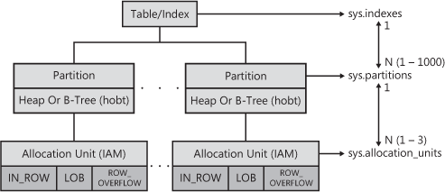

MS SQL Server physical storage
==============================

Internal storage structures (pages, extents etc.)
--------------------------------------------

The basic unit of physical storage in SQL Server is a page. A page has a fixed size of 8KB (<http://msdn.microsoft.com/en-us/library/ms186981.aspx>). 8 pages compose **an extent**. Whenever possible data is stored in rows within these pages. If the maximum size of the row is less than the page size, the row is stored using the base allocation unit type: `IN_ROW_DATA`. when a single row grows too large to be stored within a page, data can be offloaded to `ROW_OVERFLOW_DATA` pages. When a single column stores more than 8000 bytes data is stored in "LOB\_DATA" pages (<http://www.simple-talk.com/sql/database-administration/whats-the-point-of-using-varchar(n)-anymore/>).

The number of pages used by each allocation unit can be retrieved using `sys.allocation_units` view:

    select container_id, total_pages, used_pages, data_pages from sys.allocation_units

We can examine a given page in details by using `DBCC PAGE ({dbid | dbname}, filenum, pagenum[, printopt])` command. Additionally we need to run `DBCC TRACEON(3604)` to force SQL Server to send output of the `DBCC` command to a client.

The space in a database is used for storing tables and indexes. The space is managed in units called **extents**. An extent is made up of eight logically contiguous pages (or 64 KB of space). There are two types of extents: uniform and mixed. Pages in uniform extents belong to a single object, in mixed extends they are shared among different database objects. SQL Server uses two special types of pages to record which extents have been allocated: **Global Allocation Map (GAM) page** and **Shared Global Allocation Map (SGAM) page**. These pages record which extents have been allocated. A GAM has a bit for each extent in the interval it covers. If the bit is 0, the corresponding extent is in use; if the bit is 1, the extent is free.  After the header and other overhead are accounted for, there are 8,000 bytes, or 64,000 bits, available on the page, so each GAM can cover about 64,000 extents, or almost 4 GB of data. This means that one GAM page exists in a file for every 4 GB of file size. The SGAM has a bit for each extent in the interval it covers. If the bit is 1, the extent being used is a mixed extent and has free pages; if the bit is 0, the extent isn’t being used as a mixed extent, or it’s a mixed extent whose pages are all in use.

### Find a page the row is located on ###

    -- Find the Page ID
    SELECT  [lastname],
        sys.fn_PhysLocFormatter(%%physloc%%)
    FROM [dbo].[member]
    WHERE [member_no] = 1;

Tables and their storage
----------------------

Each table and index has at least one partition (sys.partitions). Each partition contains one of the following allocation units: `IN_ROW_DATA`, `ROW_OVERFLOW_DATA`, `LOB_DATA`. The term used in SQL Server 2008 to describe a subset of a table or index on a single partition is hobt, which stands for Heap Or B-Tree and is pronounced (you guessed it) "hobbit." (A B-tree is the storage structure used for indexes.) The sys.partitions view includes a column called `hobt_id`, and in SQL Server 2008, there is always a one-to-one relationship between `partition_id` and `hobt_id`. Finally there are allocation units which store information about physical data of the partitions:

Some basic queries showing the concept:

    select * from sys.indexes;

    select object_name(i.object_id),i.name,p.* From sys.partitions p
        inner join sys.indexes i on i.object_id = p.object_id and i.index_id = p.index_id;

    SELECT object_name(object_id) AS name,
        partition_id, partition_number AS pnum,  rows,
        allocation_unit_id AS au_id, type_desc as page_type_desc,
        total_pages AS pages
    FROM sys.partitions p JOIN sys.allocation_units a
       ON p.partition_id= a.container_id
    WHERE object_id=object_id('CounterMonthly');

The following query gives the value for `first_page` in the Fixed table:

    SELECT object_name(object_id) AS name,
            rows, type_desc as page_type_desc,
            total_pages AS pages, first_page
            FROM sys.partitions p JOIN sys.system_internals_allocation_units a
              ON p.partition_id = a.container_id
            WHERE object_id=object_id('dbo.Fixed');

`sys.system_internals_allocation_units` is almost the same as `sys.allocation_units` except that it stores id of the first index page. To get detail information about partition io usage use the following query:

    select * from sys.dm_db_partition_stats

Links
-----

- [Viewing SQL Server Non-Clustered Index Page Contents](http://blogs.msdn.com/b/sql_pfe_blog/archive/2013/04/04/viewing-sql-server-non-clustered-index-page-contents.aspx)
- [Sql Server storage internals](https://www.simple-talk.com/sql/database-administration/sql-server-storage-internals-101/)
- [SQL File Layout Viewer](https://sqlflv.codeplex.com/)
