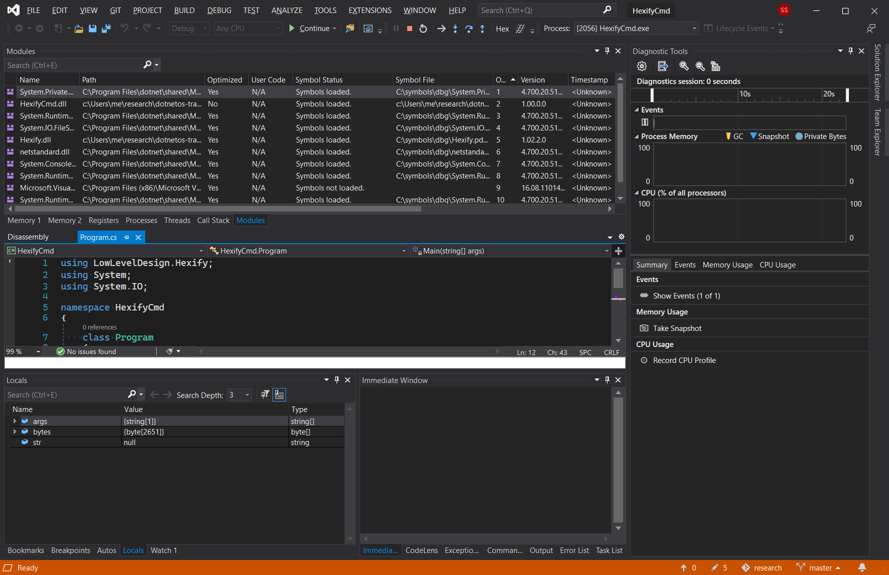

Visual Studio debugger configuration
====================================

The next sections contain information which debugger settings you should use to achieve the best exeprience when debugging .NET applications (if an option is not mentioned I assume it has the default value).

General settings
----------------

#### CHECK: Enable address-level debugging ####

#### CHECK: Show disassembly if source is not available ####

Who wouldn't like to look at assembly from time to time? :)

#### UNCHECK: Enable Just My Code ####

It's all evil - will hide the call stacks, won't allow you to set breakpoints on framework's methods etc.

#### CHECK: Enable .NET Framework source stepping ####

It does not always work but it still worth to have it on.

#### CHECK: Enable source server support ####

It is also worth to check the next two options so you will be able to investigate if your source server is not working.

#### CHECK: Redirect all Output Window text to the Immediate Window ####

I tend to use the Immediate Window as the only source of output information while debugging.

#### CHECK: Enable Source Link support

[Source Link](https://github.com/dotnet/sourcelink/blob/master/README.md) is great and we should use it!

Symbols
-------

I usually set the `_NT_SYMBOL_PATH` environment variable so that other tools (such as process explorer, windbg etc.) will use the same symbols as Visual Studio. My symbol path includes private .NET symbols and Microsoft's public symbol store, all the files are cached in C:\symbols\dbg folder:

    @setx /M _NT_SYMBOL_PATH SRV*C:\symbols\dbg*http://msdl.microsoft.com/download/symbols

I also recommend checking the **NuGet.org Symbol Server** box in the Visual Studio symbol configuration. That will enable source debugging for NuGet packages which published Symbol Packages.

Windows arrangement
-------------------

Finally, find the best windows arrangement that will suit your needs. Make sure that you see the threads running in your process. It is also worth to have the Output/Immediate window shown as Debug log land there.

My windows arrangement looks as follows:

