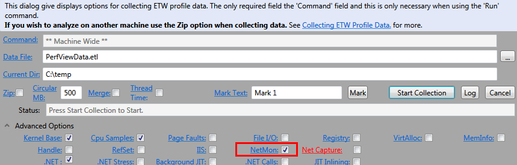

Network tracing
===============

In this recipe:

- [Traces available in .NET Framework](#traces-available-in-net-framework)
  - [Available trace sources](#available-trace-sources)
  - [Example configuration](#example-configuration)
- [Logging application requests in a proxy](#logging-application-requests-in-a-proxy)
- [Troubleshooting network on Windows](#troubleshooting-network-on-windows)
  - [Wireshark (network tracing and more)](#wireshark-network-tracing-and-more)
  - [PsPing (connectivity issues)](#psping-connectivity-issues)
    - [Measuring latency](#measuring-latency)
    - [Measuring bandwidth](#measuring-bandwidth)
  - [Event Tracing for Windows with netsh/PerfView (network tracing)](#event-tracing-for-windows-with-netshperfview-network-tracing)
- [Troubleshooting network on Linux](#troubleshooting-network-on-linux)
  - [tcpdump (network tracing)](#tcpdump-network-tracing)
  - [nc (connectivity issues)](#nc-connectivity-issues)

## Traces available in .NET Framework

All classes from `System.Net`, if configured properly, may provide a lot of interesting logs through the default System.Diagnostics mechanisms.

### Available trace sources

The below table is copied from <http://msdn.microsoft.com/en-us/library/ty48b824.aspx>

Name|Output from
----|-----------
`System.Net.Sockets`|Some public methods of the Socket, TcpListener, TcpClient, and Dns classes
`System.Net`|Some public methods of the HttpWebREquest, HttpWebResponse, FtpWebRequest and FtpWebResponse classes, and SSL debug information (invalid certificates, missing issuers list and client certificate errors).
`System.Net.HttpListener`|Some public methods of the HttpListener, HttpListenerRequest and HttpListenerResponse
`System.Net.Cache`|Some private and internal methods in System.Net.Cache
`System.Net.Http`|Some public methods of the HttpClient, DelegatingHandler, HttpClientHandler, HttpMessageHandler, MessageProcessingHandler, and WebRequestHandler classes
`System.Net.WebSockets`|Some public methods of the ClientWebSocket and WebSocket classes

Following attributes might be applied to sources to control their output:

Attribute name|Attribute value
--------------|---------------
`maxdatasize`|number that defines the maximum number of bytes of network data included in each line trace. The default value is 1024
`tracemode`|Set to **includehex** (default) to show protocol traces in hexadecimal and text format. Set to **protocolonly** to show only text.

### Example configuration

This is a configuration sample which writes network traces to a file:

```xml
<system.diagnostics>
    <trace autoflush="true" />
    <sharedListeners>
      <add name="file" initializeData="C:\logs\network.log" type="System.Diagnostics.TextWriterTraceListener" />
    </sharedListeners>
    <sources>
      <source name="System.Net.Http" switchValue="Verbose">
        <listeners>
          <add name="file" />
        </listeners>
      </source>
      <source name="System.Net.HttpListener" switchValue="Verbose">
        <listeners>
          <add name="file" />
        </listeners>
      </source>
      <source name="System.Net" switchValue="Verbose">
        <listeners>
          <add name="file" />
        </listeners>
      </source>
      <source name="System.Net.Sockets" switchValue="Verbose">
        <listeners>
          <add name="file" />
        </listeners>
      </source>
    </sources>
</system.diagnostics>
```

If you are using NLog in your application you may redirect the System.Net trace output to the `NLogTraceListener` with the following settings:

```xml
<system.diagnostics>
    <trace autoflush="true" />
    <sharedListeners>
      <add name="nlog" type="NLog.NLogTraceListener, NLog" />
    </sharedListeners>
    <sources>
      <source name="System.Net.Http" switchValue="Verbose">
        <listeners>
          <add name="nlog" />
        </listeners>
      </source>
      <source name="System.Net.HttpListener" switchValue="Verbose">
        <listeners>
          <add name="nlog" />
        </listeners>
      </source>
      <source name="System.Net" switchValue="Verbose">
        <listeners>
          <add name="nlog" />
        </listeners>
      </source>
      <source name="System.Net.Sockets" switchValue="Verbose">
        <listeners>
          <add name="nlog" />
        </listeners>
      </source>
    </sources>
</system.diagnostics>
```

## Logging application requests in a proxy

When you make a request in code you should remember to configure its proxy according to the system settings, eg.:

```csharp
var request = WebRequest.Create(url);
request.Proxy = WebRequest.GetSystemWebProxy();
request.Method = "POST";
request.ContentType = "application/json; charset=utf-8";
...
```

or in the configuration file:

```xml
  <system.net>
    <defaultProxy>
      <proxy autoDetect="False" proxyaddress="http://127.0.0.1:8080" bypassonlocal="False" usesystemdefault="False" />
    </defaultProxy>
  </system.net>
```

Then run [Fiddler](http://www.telerik.com/fiddler) (or [Burp Suite](https://portswigger.net/burp/) or any other proxy) and requests data should be logged in the sessions window. Unfortunately this approach won't work for requests to applications served on the local server. A workaround is to use one of the Fiddler's localhost alternatives in the url: `ipv4.fiddler`, `ipv6.fiddler` or `localhost.fiddler` (more [here](http://docs.telerik.com/fiddler/Configure-Fiddler/Tasks/MonitorLocalTraffic)).

**NOTE for WCF clients**: WCF has its own proxy settings, to use the default proxy add an `useDefaultWebProxy=true` attribute to your binding.

## Troubleshooting network on Windows

### Wireshark (network tracing and more)

In my opinion, the best tool to analyze network traffic on Windows is [Wireshark](https://www.wireshark.org/). There are only two problems with it:

- requires a driver - this could be a problem on servers
- does not log the process ID in the trace

We can easily solve the second issue by [combining the Wireshark trace with the Process Monitor logs](https://lowleveldesign.org/2018/05/11/correlate-pids-with-network-packets-in-wireshark/).

### PsPing (connectivity issues)

PsPing (a part of [Sysinternals toolkit](https://technet.microsoft.com/en-us/sysinternals)) has few interesting options when it comes to diagnosing network connectivity issues. The simplest usage is just a replacement for a ping.exe tool (performs ICMP ping):

    > psping www.google.com

By adding a port number at the end of the host we will measure a TCP handshake (or discover a closed port on the remote host):

    > psping www.google.com:80

To test UDP add **-u** option on the command line.

#### Measuring latency

We need to run a PsPing in a server mode on the other side (-f for creating a temporary exception in the Windows Firewall, -s to enable server listening mode):

    > psping -f -s 192.168.1.3:4000

Then we start the client and perform the test:

    > psping -l 16k -n 100 192.168.1.3:4000

#### Measuring bandwidth

We need to run a PsPing in a server mode on the other side (-f for creating a temporary exception in the Windows Firewall, -s to enable server listening mode):

    > psping -f -s 192.168.1.3:4000

Then we start the client and perform the test:

    > psping -b -l 16k -n 100 192.168.1.3:4000

### Event Tracing for Windows with netsh/PerfView (network tracing)

Starting with Windows 7 (2008 Server) you don't need to install anything (such as WinPcap or Network Monitor) on the server to collect network traces. You can simply use `netsh trace {start|stop}` command which will create an ETW session with the interesting ETW providers enabled. Few diagnostics scenarios are available and you may list them using `netsh trace show scenarios`:

```
PS Temp> netsh trace show scenarios

Available scenarios (18):
-------------------------------------------------------------------
AddressAcquisition       : Troubleshoot address acquisition-related issues
DirectAccess             : Troubleshoot DirectAccess related issues
FileSharing              : Troubleshoot common file and printer sharing problems
InternetClient           : Diagnose web connectivity issues
InternetServer           : Set of HTTP service counters
L2SEC                    : Troubleshoot layer 2 authentication related issues
LAN                      : Troubleshoot wired LAN related issues
Layer2                   : Troubleshoot layer 2 connectivity related issues
MBN                      : Troubleshoot mobile broadband related issues
NDIS                     : Troubleshoot network adapter related issues
NetConnection            : Troubleshoot issues with network connections
P2P-Grouping             : Troubleshoot Peer-to-Peer Grouping related issues
P2P-PNRP                 : Troubleshoot Peer Name Resolution Protocol (PNRP) related issues
RemoteAssistance         : Troubleshoot Windows Remote Assistance related issues
Virtualization           : Troubleshoot network connectivity issues in virtualization environment
WCN                      : Troubleshoot Windows Connect Now related issues
WFP-IPsec                : Troubleshoot Windows Filtering Platform and IPsec related issues
WLAN                     : Troubleshoot wireless LAN related issues
```

*NOTE: For DHCP traces you may check `netsh dhcpclient trace ...` commands. Also LAN and WLAN modes have some tracing capabilities which you may enable with a command `netsh (w)lan set tracing mode=yes` and stop with a command `netsh (w)lan set tracing mode=no`*

To know exactly which providers are enabled in each scenario use `netsh trace show scenario {scenarioname}`. After choosing the right scenario for your diagnosing case start the trace with a command:

```batchfile
netsh trace start scenario={yourscenario} capture=yes correlation=no report=no tracefile={the-output-etl-file}

Example:
    netsh trace start scenario=internetclient capture=yes correlation=no report=no tracefile=d:\temp\net.etl
```

After some time (or after performing the faulty network operation) stop the trace with a command:

```batchfile
netsh trace stop
```

A new .etl file should be created in the output directory (as well as a .cab file with some interesting system logs). Some ETW providers do not generate information about the processes related to the specific events (for instance WFP provider) - keep this in mind when choosing your own set.

Many interesting capture filters are available, you may use `netsh trace show CaptureFilterHelp` to list them. Most interesting include `CaptureInterface`, `Protocol`, `Ethernet.`, `IPv4.` and `IPv6.` options set, example:

    netsh trace start scenario=InternetClient capture=yes CaptureInterface="Local Area Connection 2" Protocol=TCP Ethernet.Type=IPv4 IPv4.Address=157.59.136.1 maxSize=250 fileMode=circular overwrite=yes traceFile=c:\temp\nettrace.etl

    netsh trace stop

**PerfView** also provides a way to collect network trace (under the hood it uses netsh command). There are two options to collect network traces in PerfView: **NetMon** and **Net Capture**:



I recommend checking the NetMon option as it will generate a seperate .etl file containing just the network traces. We may later open this file in [Message Analyzer](https://www.microsoft.com/en-us/download/details.aspx?id=44226) and analyze the collected data.

## Troubleshooting network on Linux

### tcpdump (network tracing)

Most commonly used tool to collect network traces on Linux is **tcpdump**. The BPF language is quite complex and allows various filtering options. A great explanation of its syntax can be found [here](http://www.biot.com/capstats/bpf.html). Below, you may find example session configurations.

View traffic only between two hosts:

```
tcpdump host 192.168.0.1 && host 192.168.0.2
```

View traffic in a particular network:

```
tcpdump net 192.168.0.1/24
```

Dump traffic to a file and rotate it every 1KB:

```
tcpdump -C 1024 -w test.pcap
```

### nc (connectivity issues)

To check if there is anything listening on a TCP port 80 on a remote host, run:

```
nc -vnz 192.168.0.20 80
```
