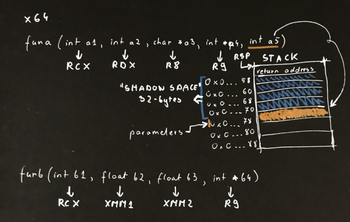
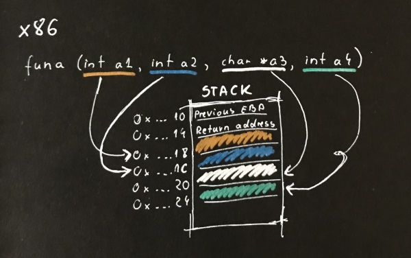

# Basic reversing

In this recipe:

- [Collect basic information about the executable (Windows)](#collect-basic-information-about-the-executable-windows)
- [Understand calling conventions](#understand-calling-conventions)
  - [AMD64](#amd64)
  - [x86 (stdcall and pascall)](#x86-stdcall-and-pascall)
  - [x86 (cdecl)](#x86-cdecl)
  - [x86 (fastcall)](#x86-fastcall)
  - [x86 (clrcall)](#x86-clrcall)
  - [x86 (thiscall)](#x86-thiscall)
- [Use reversing tools](#use-reversing-tools)
  - [Ghidra](#ghidra)
  - [IDA Freeware](#ida-freeware)

## Collect basic information about the executable (Windows)

**Dumpbin** (part of the Windows SDK) is a command line tool which dumps various information about the executable:

- dump all PE headers and disassemble the .text sections: `dumpbin /all /disasm:nobytes /out:file.asm file.dll`
- dump information about the exported methods in the PE file: `dumpbin /exports file.dll`
- dump PE file headers: `dumpbin /headers file.dll`

A great tool to track dependencies between PE files is [**Dependencies**](https://github.com/lucasg/Dependencies), a rewrite of the [Dependency Walker](http://www.dependencywalker.com/).

## Understand calling conventions

### AMD64

Parameters less than 64 bits long are not zero extended; the high bits contain garbage. It is the caller's responsibility to allocate 32 bytes of "shadow space" (for storing RCX, RDX, R8, and R9 if needed) before calling the function:

It is also the caller's responsibility to clean the stack after the call. Integer return values (similar to x86) are returned in RAX if 64 bits or less. Floating point return values are returned in XMM0.

As there is no base pointer in x64 the debugger uses something called unwind info, which is embedded into the binary. You may dump the unwind info with dumpbin /unwindinfo. Within the debugger we may use the .fnent command. Excellent article about it can be found [here](https://blogs.msdn.microsoft.com/ntdebugging/2010/5/12/x64-manual-stack-reconstruction-and-stack-walking/).

### x86 (stdcall and pascall)

Arguments: right to left
Stack-maintenance: called function pops its arguments from the stack

### x86 (cdecl)

Arguments: from right to left
Stack-maintenance: calling function pops arguments from the stack

### x86 (fastcall)

Arguments: first 2 DWORD or smaller arguments are passed in ECX and EDX registers; all other arguments are passed right to left
Stack-maintenance: called function pops arguments from the stack

### x86 (clrcall)

Similar to fastcall. Two registers are used by the x86 jitter (ecx, edx). Large value types like Decimal and large structs are passed by reserving space on the caller's stack, copying the value into it and passing a pointer to this copy. The callee copies it again to its own stack frame.

### x86 (thiscall)

Arguments: right to left, with this being passed via ECX register (for vararg functions cdecl is being used, with `this` pushed on the stack as the last)
Stack-maintenance: called function pops arguments from the stack

## Use reversing tools

### Ghidra

When you need to understand the logic in an application, a simple assembly listing might not be enough. There are various tools available in the market that can disassemble and nicely output the assembly code, but my favourite one is [**Ghidra**](https://ghidra-sre.org/), an open-source reverse engineering software released by NSA. It even has a decompiler and supports lots of platforms. The section below contains a set of basic shortcuts to help you find your way around in this tool. 

| Shortcut      | Description       |
| ------------- | ----------------- |
| G             | Go to address |
| L             | Change label |
| Alt+larrow    | Go back |
| ;             | Set comment |
| Ctrl+uarrow   | Previous function |
| Ctrl+darrow   | Next function |
| Middle mouse  | Select a symbol |

Marks:

| Shortcut      | Description       |
| ------------- | ----------------- |
| Ctrl+D        | Set bookmark |
| Ctrl+Alt+B    | Next bookmark |

To rebase an image, open the memory window, click on the button with a house icon and type the new base address.

### IDA Freeware

Before Ghidra, another tool I used was the free version of [**IDA**](https://www.hex-rays.com/products/ida/support/download_freeware.shtml). The table below contains some of its shortcuts.

| Shortcut      | Description       |
| ------------- | ----------------- |
| Space         | Switch to graph/assembly |
| Esc           | Go back |
| Ctrl+Enter    | Go forward |
| N             | Rename variable |
| Tab           | Switch to pseudo-code |

Jumps:

| Shortcut      | Description       |
| ------------- | ----------------- |
| Ctrl+P        | Function |
| Ctrl+L        | Symbol |
| Ctrl+S        | Segment |
| Ctrl+E        | Entry point |
| Ctrl+X        | Shows refs to the selected address |
| Ctrl+J        | Shows refs from the selected address |

Marks:

| Shortcut      | Description       |
| ------------- | ----------------- |
| Alt+M         | Create a mark |
| Ctrl+M        | Jump to a mark |

Search:

| Shortcut      | Description       |
| ------------- | ----------------- |
| Alt+T         | Text search |
| Ctrl+T        | Next text search |
| Alt+B         | Binary search |
| Ctrl+B        | Next binary search |
