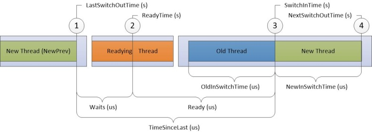

Analyzing locks
===============

In this recipe:

  - [Collecting ETW traces](#collecting-etw-traces)
  - [Analyzing ETW traces](#analyzing-etw-traces)
    - [Using PerfView](#using-perfview)
    - [Using WPA](#using-wpa)
  - [Diagnosing locks in a debugger (including dumps)](#diagnosing-locks-in-a-debugger-including-dumps)
    - [Automatic detection of the dead-locks (managed)](#automatic-detection-of-the-dead-locks-managed)
    - [Correlate thread ids with thread objects (managed)](#correlate-thread-ids-with-thread-objects-managed)
    - [Iterate through execution contexts assigned to threads (managed)](#iterate-through-execution-contexts-assigned-to-threads-managed)
    - [List locks (managed)](#list-locks-managed)
    - [Check locks in kernel mode](#check-locks-in-kernel-mode)
    - [Examine threadpools](#examine-threadpools)
    - [Examine critical sections](#examine-critical-sections)

## Collecting ETW traces

In **PerfView** you need to select the **Thread Time** checkbox in the collect window.

To collect traces with **xperf** run:

    xperf -on PROC_THREAD+LOADER+PROFILE+INTERRUPT+DPC+DISPATCHER+CSWITCH -stackwalk Profile+CSwitch+ReadyThread
    xperf -stop -d merged.etl

## Analyzing ETW traces

Event Tracing for Windows is probably the best option when we need to analyze the thread waits. In the paragraphs below you can find information

### Using PerfView

You need to select the ThreadTime in the collection dialog. With this setting PerfView will record context switch events as well as the usual stack dumps every 100ms.

When analyzing blocks use any of the **Thread Time** views. It's best to start with the **Call Stack** view, exclude threads which seem not interesting and locate blocks which might be connected with your investigation. Then for each block time narrow the time to its start and try to guess the flow of the commands that fire it (what was executed last on each thread and what might be the cause of the wait).

You may check [the post](https://lowleveldesign.wordpress.com/2015/10/01/understanding-the-thread-time-view-in-perfview/) on my blog explaining in details Thread Time view in PerfView.

### Using WPA

There are two interesting groups of graphs to analyze in WPA: **CPU Usage (Sample)** and **CPU Usage (Precise)**. You may download my [WPA Profile](async-analysis-profile.wpaProfile) or use one of the predefined ones. 

On the **CPU Usage (Precise)** graph, we should start from our hanging thread and found its readying thread. Then check which thread readied this thread and so on. This chain should bring to us to the final thread which might be a system thread performing some I/O operations.

When working with this view it's always worth to have in mind the thread states diagram from MSDN:



## Diagnosing locks in a debugger (including dumps)

### Automatic detection of the dead-locks (managed)

Try running the **!dlk** command from the SOSEX extension. It is pretty good in detecting dead-locks, example:

```
0:007> .load sosex
0:007> !dlk
Examining SyncBlocks...
Scanning for ReaderWriterLock(Slim) instances...
Scanning for holders of ReaderWriterLock locks...
Scanning for holders of ReaderWriterLockSlim locks...
Examining CriticalSections...
Scanning for threads waiting on SyncBlocks...
Scanning for threads waiting on ReaderWriterLock locks...
Scanning for threads waiting on ReaderWriterLocksSlim locks...
*** WARNING: Unable to verify checksum for C:\WINDOWS\assembly\NativeImages_v4.0.30319_32\System\3a4f0a84904c4b568b6621b30306261c\System.ni.dll
*** WARNING: Unable to verify checksum for C:\WINDOWS\assembly\NativeImages_v4.0.30319_32\System.Transactions\ebef418f08844f99287024d1790a62a4\System.Transactions.ni.dll
Scanning for threads waiting on CriticalSections...
*DEADLOCK DETECTED*
CLR thread 0x1 holds the lock on SyncBlock 011e59b0 OBJ:02e93410[System.Object]
...and is waiting on CriticalSection 01216a58
CLR thread 0x3 holds CriticalSection 01216a58
...and is waiting for the lock on SyncBlock 011e59b0 OBJ:02e93410[System.Object]
CLR Thread 0x1 is waiting at clr!CrstBase::SpinEnter+0x92
CLR Thread 0x3 is waiting at System.Threading.Monitor.Enter(System.Object, Boolean ByRef)(+0x17 Native)
```

### Correlate thread ids with thread objects (managed)

The `!Threads` commands does not unfortunately show addresses of the managed thread objects on the heap. So first you need to find the MT of the `Thread` class in your appdomain, eg.

```
0:036> !Name2EE mscorlib.dll System.Threading.Thread
Module:      72551000
Assembly:    mscorlib.dll
Token:       020001d1
MethodTable: 72954960
EEClass:     725bc0c4
Name:        System.Threading.Thread
```

Then run this script written by Naveen (<http://stackoverflow.com/questions/4616584/windbg-sos-how-to-correlate-managed-threads-from-threads-command-with-system-t>):

```
.foreach ($t {!dumpheap -mt 72954960 -short}) {  .printf " Thread Obj ${$t} and the Thread Id is %N \n",poi(${$t}+28) }
```

The printed ids corresond to the values of the ID column in `!Threads` output, eg:

```
       ID OSID ThreadOBJ    State GC Mode     GC Alloc Context  Domain   Count Apt Exception
   9    1 17dc 05146278     28220 Preemptive  1DF58070:00000000 050d8b18 0     Ukn
  31    2 1544 05162618     2b220 Preemptive  00000000:00000000 050d8b18 0     MTA (Finalizer)
  33    3 16b8 05193430   102a220 Preemptive  00000000:00000000 050d8b18 0     MTA (Threadpool Worker)
  34    4 1388 05198440     21220 Preemptive  00000000:00000000 050d8b18 0     Ukn
```

### Iterate through execution contexts assigned to threads (managed)

When debugging locks in code that is using tasks it is often necessary to examine execution contexts assigned to the running threads. I prepared a simple script which lists threads with their execution contexts. You only need (as in previous script) find the MT of the `Thread` class in your appdomain, eg.

```
0:036> !Name2EE mscorlib.dll System.Threading.Thread
Module:      72551000
Assembly:    mscorlib.dll
Token:       020001d1
MethodTable: 72954960
EEClass:     725bc0c4
Name:        System.Threading.Thread
```

And then paste it in the scripts below:

    x86:

    .foreach ($addr {!DumpHeap -short -mt <METHODTABLE> }) { .printf /D "Thread: %i; Execution context: <link cmd=\"!do %p\">%p</link>\n", poi(${$addr}+28), poi(${$addr}+8), poi(${$addr}+8) }

    x64:

    .foreach ($addr {!DumpHeap -short -mt <METHODTABLE> }) { .printf /D "Thread: %i; Execution context: <link cmd=\"!do %p\">%p</link>\n", poi(${$addr}+4c), poi(${$addr}+10), poi(${$addr}+10) }

Notice that the thread number from the output is a managed thread id and to map it to the windbg thread number you need to use the `!Threads` command.

### List locks (managed)

You may examine thin locks using **!DumpHeap -thinlocks**.  To find all hard locks (the ones that were created after the object header was full) use **!SyncBlk -all** command.

There are many types of objects that the thread can wait on. You usually see many `WaitOnMultipleObjects` on many threads.

If you see RtlWaitForCriticalSection or other method connected with a critical section it might indicate that the program hang. In order to find the cause of this situation you may use following commands:

    !locks shows the contained lock, use ~~[<thread>] to switch to a given thread
    !cs shows all critical sections in the program (dump)
    !timers presents all timers running in system

### Check locks in kernel mode

Another command that can be useful here is **!locks**. With **-v** parameter will display all locks accessed by threads in a process.

### Examine threadpools

There is a special `!tp` extension command that has numerous options to analyze threadpools in processes.

### Examine critical sections

Use **!cs** comman to examine critical sections in your applications:

    0:033> !cs -s 000000001a496f50
    -----------------------------------------
    Critical section   = 0x000000001a496f50 (+0x1A496F50)
    DebugInfo          = 0x0000000013c9bee0
    LOCKED
    LockCount          = 0x0
    WaiterWoken        = No
    OwningThread       = 0x0000000000001b04
    RecursionCount     = 0x1
    LockSemaphore      = 0x0
    SpinCount          = 0x00000000020007d0

`LockCount` tells you how many threads are currently waiting on a given cs. The `OwningThread` is a thread that owns the cs at the time the command is run. You can easily identify the thread that is waiting on a given cs by issuing `kv` command and looking for critical section identifier in the call parameters.
