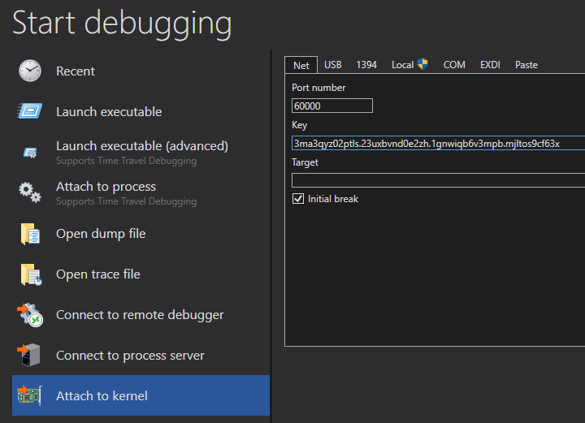

# Windows Kernel Debugging

In this recipe:

<!-- MarkdownTOC -->

- [Setup Windows Kernel Debugging over network](#setup-windows-kernel-debugging-over-network)
    - [Network card compatibility check](#network-card-compatibility-check)
- [Setup Kernel debugging in QEMU/KVM](#setup-kernel-debugging-in-qemukvm)
- [Control processes in the debugger](#control-processes-in-the-debugger)
    - [Get process information](#get-process-information)
    - [Break when user-mode process is created](#break-when-user-mode-process-is-created)
    - [Break in user-mode process from the kernel-mode](#break-in-user-mode-process-from-the-kernel-mode)

<!-- /MarkdownTOC -->

## Setup Windows Kernel Debugging over network

*HYPER-V note*: When debugging a Gen 2 VM remember to turn off the secure booting: 
**Set-VMFirmware -VMName "Windows 2012 R2" -EnableSecureBoot Off -Confirm**

Turn on network deubugging (HOSTIP is the address of the machine on which we will run the debugger):

C:\Windows\system32>**bcdedit /dbgsettings NET HOSTIP:192.168.0.2 PORT:60000**
Key=3ma3qyz02ptls.23uxbvnd0e2zh.1gnwiqb6v3mpb.mjltos9cf63x

C:\Windows\system32>**bcdedit /debug {current} on**
The operation completed successfully.

Then on the host machine, run windbg, select **Attach to kernel** and fill the port and key textboxes:



### Network card compatibility check

Starting from Debugging Tools for Windows 10 we have an additional tool: **kdnet.exe**. By running it on the guest you may see if your network card supports kernel debugging and get the instructions for the host machine: 

```
C:\tools\x64>kdnet 172.25.121.1 60000

Enabling network debugging on Microsoft Hypervisor Virtual Machine.
Key=1a88vu15z4lta.8q4ler06jr8v.1fv4h88r9e0ob.1139s57nv8obj

To finish setting up KDNET for this VM, run the following command from an
elevated command prompt running on the Windows hyper-v host.  (NOT this VM!)
powershell -ExecutionPolicy Bypass kdnetdebugvm.ps1 -vmguid DD4F4AFE-9B5F-49AD-8
775-20863740C942 -port 60000

To debug this vm, run the following command on your debugger host machine.
windbg -k net:port=60000,key=1a88vu15z4lta.8q4ler06jr8v.1fv4h88r9e0ob.1139s57nv8
obj,target=DELAPTOP

Then make sure to SHUTDOWN (not restart) the VM so that the new settings will
take effect.  Run shutdown -s -t 0 from this command prompt.
```

## Setup Kernel debugging in QEMU/KVM

The tutorial at <https://resources.infosecinstitute.com/topic/kernel-debugging-qemu-windbg/> helped me a lot to achieve this.

The main idea is to use the Unix pipe. One side (debugger host) must have the serial port in the bind mode and the other side (client) in a connect mode. Example configuration in QEMU:

```xml
<serial type="unix">
  <source mode="bind" path="/tmp/dbgpipe"/>
  <target type="isa-serial" port="1">
    <model name="isa-serial"/>
  </target>
  <alias name="serial1"/>
</serial>
```

```xml
<serial type="unix">
  <source mode="connect" path="/tmp/dbgpipe"/>
  <target type="isa-serial" port="1">
    <model name="isa-serial"/>
  </target>
  <alias name="serial1"/>
</serial>
```

The serial1 on virtualized Windows appears as the COM2 port.

## Control processes in the debugger

### Get process information

We can use the `!process` command to locate a process by its image name:

    0: kd> !process 0 0 LINQPad.UserQuery.exe
    PROCESS ffffda07cd4da4c0
        SessionId: 6  Cid: 3168    Peb: 4b61e15000  ParentCid: 1e5c
        DirBase: 1e6165002  ObjectTable: ffffb2813a6dcd00  HandleCount: 529.
        Image: LINQPad.UserQuery.exe

    PROCESS ffffda07bfa49080
        SessionId: 6  Cid: 427c    Peb: c0d32c9000  ParentCid: 1e5c
        DirBase: 3b2173002  ObjectTable: ffffb2812cd5ad40  HandleCount: 397.
        Image: LINQPad.UserQuery.exe

### Break when user-mode process is created

**bp nt!PspInsertProcess**

The breakpoint is hit whenever a new user-mode process is created. To know what process is it we may access the \_EPROCESS structure ImageFileName field.

    x64: dt nt!_EPROCESS @rcx ImageFileName
    x86: dt nt!_EPROCESS @eax ImageFileName

### Break in user-mode process from the kernel-mode

You may set a breakpoint in user space, but you need to be in a valid process context:

```
kd> !process 0 0 notepad.exe
PROCESS ffffe0014f80d680
    SessionId: 2  Cid: 0e44    Peb: 7ff7360ef000  ParentCid: 0aac
    DirBase: 2d497000  ObjectTable: ffffc00054529240  HandleCount: 
    Image: notepad.exe

kd> .process /i ffffe0014f80d680
You need to continue execution (press 'g' ) for the context
to be switched. When the debugger breaks in again, you will be in
the new process context.

kd> g
```

Then when you are in a given process context, set the breakpoint:

```
kd> .reload /user
kd> !process -1 0
PROCESS ffffe0014f80d680
    SessionId: 2  Cid: 0e44    Peb: 7ff7360ef000  ParentCid: 0aac
    DirBase: 2d497000  ObjectTable: ffffc00054529240  HandleCount: 
    Image: notepad.exe

kd> x kernel32!CreateFileW
00007ffa`d8502508 KERNEL32!CreateFileW ()
kd> bp 00007ffa`d8502508
```

Alternative way (which does not require process context switching) is to use data execution breakpoints, eg.:

```
kd> !process 0 0 notepad.exe
PROCESS ffffe0014ca22480
    SessionId: 2  Cid: 0614    Peb: 7ff73628f000  ParentCid: 0d88
    DirBase: 5607b000  ObjectTable: ffffc0005c2dfc40  HandleCount: 
    Image: notepad.exe

kd> .process /r /p ffffe0014ca22480
Implicit process is now ffffe001`4ca22480
.cache forcedecodeuser done
Loading User Symbols
..........................

kd> x KERNEL32!CreateFileW
00007ffa`d8502508 KERNEL32!CreateFileW ()
kd> ba e1 00007ffa`d8502508
```

For both those commands you may limit their scope to a particular process using /p switch.
